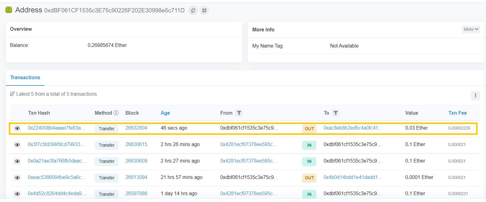
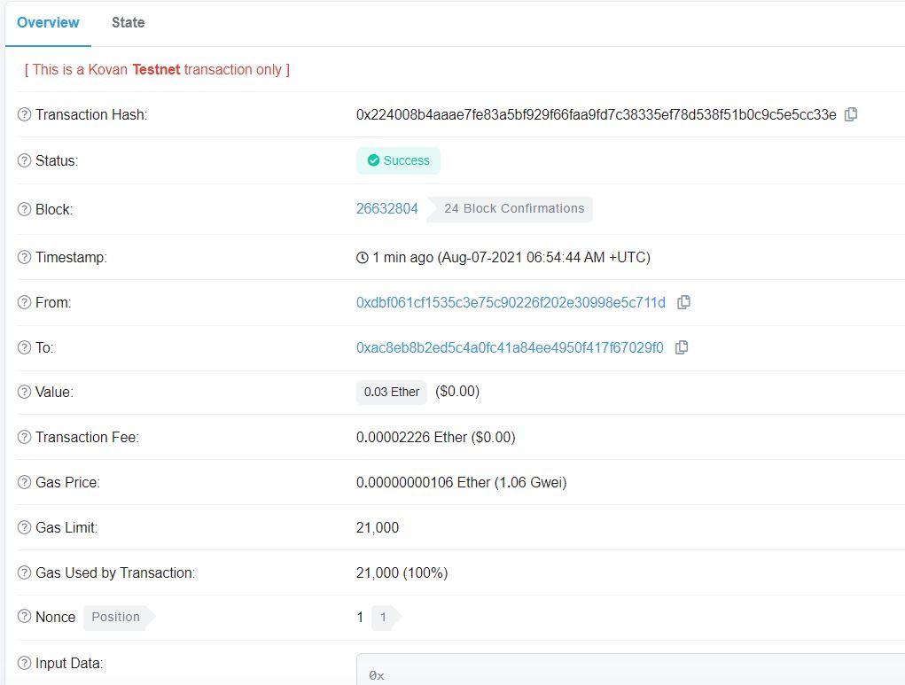
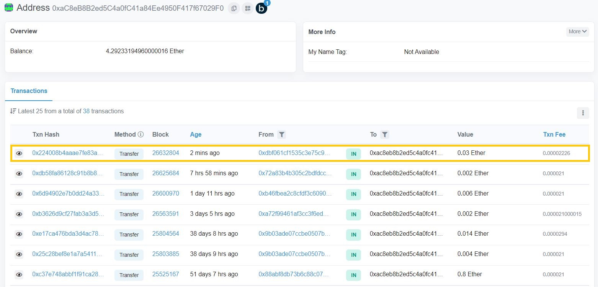

# Fin-Tech_Challenge_19_Cryptocurrency_Wallet

You work at a startup that is building a new and disruptive platform called Fintech Finder. Fintech Finder is an application that its customers can use to find fintech professionals from among a list of candidates, hire them, and pay them. As Fintech Finder’s lead developer, you have been tasked with integrating the Ethereum blockchain network into the application in order to enable your customers to instantly pay the fintech professionals whom they hire with cryptocurrency. In this Challenge, you will complete the code that enables your customers to send cryptocurrency payments to fintech professionals. To develop the code and test it out, you will assume the perspective of a Fintech Finder customer who is using the application to find a fintech professional and pay them for their work.


## Overview

Suppose Jane is hired to work for 0.15 hours; based on her hourly wage, we pay her 0.03 `eher` by doing the following steps:

1. Fetch my Ethereum account address and hers.
2. Calculate the total value of an Ethereum transaction, including the gas estimate.
3. Construct a transaction object.
4. Digitally sign the transaction.
5. Send the transaction to the Kovan testnet.


#### 1. My address balance and the transaction history on Etherscan




#### 2. The transaction details on Etherscan




#### 3. Recipient(Jane)’s address balance and history on Etherscan




## Technologies

This project leverages python 3.7 with the following packages:

* [Streamlit](https://discuss.streamlit.io/t/set-default-height-and-width-for-st-write-for-magic/729/2) - Streamlit is an open-source app framework for Machine Learning and Data Science teams. Create beautiful data apps in hours, not weeks. All in pure Python.
* [Web3.py ](https://web3py.readthedocs.io/en/stable/overview.html) - A Python library for connecting to and performing operations on Ethereum-based blockchains.
* [ethereum-tester](https://pypi.org/project/ethereum-tester/0.1.0a4/) - A Python library that provides access to the tools we’ll use to test Ethereum-based applications.
* [mnemonic](https://pypi.org/project/mnemonic/) -  A Python implementation for generating a 12- or 24-word mnemonic seed phrase based on the BIP-39 standard.
* [bip44](https://pypi.org/project/bip44/) - A Python implementation for deriving hierarchical deterministic wallets from a seed phrase based on the BIP-44 standard.
* [Infura API](https://infura.io/) - An API that provides instant access to the Ethereum network over HTTPS (i.e., the web). You will need to create an account with Infura.


## Installation Guide

To install the Streamlit library, check that your `dev` virtual environment is active, and then run the following command:

```python
pip install streamlit
pip install web3==5.17
pip install eth-tester==0.5.0b3
pip install mnemonic
pip install bip44
```


### Troubleshooting Guide

It can be frustrating when packages do not install correctly. Use the following approaches to troubleshoot any installation or usage issues.


#### Install Microsoft Visual C++ Build Tools in Windows

In some cases, the `Web3.py` library may fail to install in Microsoft Windows due to the need for Microsoft Visual C++ Build Tools. If this happens, follow these steps to resolve the issue:

1. Go to [https://visualstudio.microsoft.com/downloads/ (Links to an external site.)](https://visualstudio.microsoft.com/downloads/).  
2. Scroll down the page, and then click "Tools for Visual Studio 2019" to reveal the options.  
3. Download the "Build Tools for Visual Studio 2019" package.
4. Run the package file and select the C++ Build Tools option. Then click Install. The installation process takes about 15 minutes.


## Usage

To use the  application simply clone the repository, and run the **fintech_finder.py** with:

```bash
streamlit run fintech_finder.py
```

